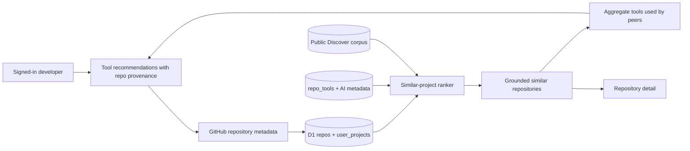

## Context

See [proposal.md](proposal.md) for motivation. The current `/projects` surface
loads a checked-in Fleet snapshot and ranks only the signed-in user's saved or
starred repositories against it. Alerts, reports, Stack Builder, Radar, and the
weekly digest add routes and jobs but do not strengthen the new project-aware
discovery job.

The app already has GitHub OAuth, a shared `repos` catalog, D1 user ownership
patterns, Discover queries, normalized `repo_tools`, and repository detail
routes. The embedding dimension and Worker binding contracts remain unchanged.

## Goals / Non-Goals

**Goals:**

- Make connected public GitHub repositories the only project source.
- Persist connections per user and keep connection APIs ownership-scoped.
- Reuse the public repository catalog and existing repository details.
- Produce deterministic, explainable project recommendations from available
  language, topic, description, AI metadata, and tool evidence.
- Treat similar repositories as the grounding set for tool recommendations;
  every proposed tool must be traceable to one or more of those peers.
- Keep the complete connected-project workflow free.
- Delete inactive product surfaces and their reachable support code.

**Non-Goals:**

- Private repositories or a broader GitHub OAuth permission.
- Dependency installation, automated code changes, or stack generation.
- A learned recommender, billing, teams, alerts, reports, or email.
- Dropping historical D1 tables during this change.

## Decisions

### Store connections as a user-to-repository relation

Add `user_projects(user_id, repo_id, connected_at)` with a composite primary
key and indexed user ordering. Repository metadata stays in the existing shared
`repos` table.

This avoids duplicating GitHub metadata and follows the current `user_repos`
ownership model. A JSON profile blob was rejected because it weakens ownership
queries and referential integrity.

### Resolve public repositories with the current authorization boundary

The project form accepts a GitHub URL or `owner/repository`, normalizes it, and
resolves it through GitHub's repository endpoint. The existing access token may
be sent for rate-limit headroom, but the product accepts only repositories that
are publicly readable. It does not request `repo` scope.

Repository picking from all private and organization repositories was rejected
for this release because it materially changes the permission and privacy
contract.

### Rank peers first, then derive tools from peers

The recommendation endpoint loads the owned connected project, its normalized
tool rows, and a bounded eligible candidate set from the shared catalog. A
small pure ranking module scores concrete overlaps such as language, topics,
tool categories/tools, and meaningful metadata tokens. Popularity is a
tie-breaker, not project-match evidence.

Every similar repository carries human-readable evidence. The tool layer then
aggregates normalized `repo_tools` rows only from those ranked peers, excludes
tools already detected in the connected project, and returns repository-level
provenance for every tool. It does not invent a tool or infer one from prose.

If no project-specific signal is available, the endpoint explicitly returns a
broad-discovery fallback state and does not present tools from that broad list
as grounded recommendations. Vector similarity can be added later behind the
same peer response contract.

### Keep project intelligence free

The project connection, similar-project results, and peer-grounded tool
recommendations have no billing or entitlement check. Paid plans, checkout,
subscriptions, usage credits, and premium locks are outside the product.

### Remove product code, retain historical storage

Delete the pages, APIs, components, tests, scripts, and scheduled workflow for
Alerts, Reports, Stack Builder, Radar, weekly digest, and Fleet projects. Keep
the old alert/report tables in the baseline migration so rollout does not
perform a destructive data migration. They become inert historical storage.

### Keep the incumbent interface and simplify navigation

The visual system remains unchanged. The authenticated product navigation
becomes Discover, Projects, Tools, and Library. Projects uses one primary
connection action, a compact connected-project list, and an evidence-led
recommendation state.

## Risks / Trade-offs

- [Public-only projects may exclude important work] -> State the boundary in
  the UI and treat private access as a separate permission decision.
- [New projects may lack tool enrichment] -> Fall back to language, topics, and
  metadata and label broad discovery honestly.
- [Deterministic ranking is simpler than semantic ranking] -> Keep the scorer
  pure, tested, and explainable so evaluation can improve weights safely.
- [Removed links may have external traffic] -> Allow normal 404 behavior for
  removed products; do not preserve misleading shells.
- [Migration must precede application rollout] -> Add an additive migration,
  run local migration tests, and document that remote application requires
  separate approval.

## Migration Plan

1. Add and validate the additive `user_projects` migration locally.
2. Ship the application only after the production migration is explicitly
   approved and applied.
3. If rollback is needed, roll back application code; leaving the additive
   table in place is harmless.

## Open Questions

- Whether a later private-project release should request broad `repo` scope or
  use a narrower GitHub App installation model.
