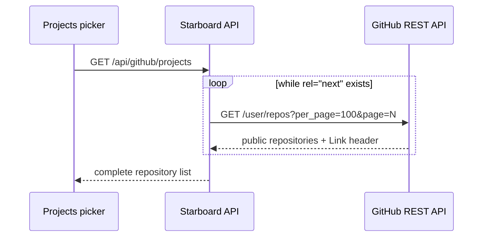

## Context

See [proposal.md](proposal.md) for motivation. The authenticated app already uses a shared shell, Discover is public, the GitHub project picker uses the existing `read:user` token, and Tool Intelligence already receives scope and evidence metadata from one API. The current defects come from local defaults, a one-page GitHub request, and presentation that hides meaning in tooltips or warning styling.

## Goals / Non-Goals

**Goals:**

- Preserve explicit callback URLs while making Discover the generic authentication destination.
- Traverse GitHub's paginated public-repository response without an artificial product cap or duplicate pages.
- Keep virtualized repository rows measurable while preventing long names, descriptions, and topics from colliding or changing row height.
- Reuse one scope-definition model across the Tool Intelligence index and detail pages.
- Strengthen the existing landing hierarchy using current content, tokens, and public routes.
- Keep authenticated sessions out of build-time/static HTML caches and explicitly mark protected routes private.

**Non-Goals:**

- Requesting private-repository access or broader GitHub permissions.
- Changing recommendation ranking, tool detection thresholds, or catalog membership.
- Replacing the application shell, brand palette, Library selection toolbar, or landing visual language.

## Decisions

### Paginate from GitHub's response links

The repository fetcher will request 100 items per page, follow only GitHub API `rel="next"` links, and reject repeated pagination URLs. This returns the complete accessible public set while preventing an accidental loop. A fixed page count was rejected because it would reproduce the same missing-repository failure for larger accounts.

### Keep virtualized card rows fixed and compact

The grid will keep a fixed estimated/measured row size so virtualization remains predictable. Header content receives explicit `min-width: 0`, the repository link becomes a block-level truncation boundary, action controls remain shrink-proof, descriptions stay at two lines, and topic badges are limited to one clipped row. Letting cards grow independently was rejected because it breaks row virtualization and reintroduces large empty gaps.

### Use explanatory content instead of warning semantics

Both Tool Intelligence pages will share scope labels and descriptions from one small module. A neutral “How Tool Intelligence works” panel will explain sources, confidence, and counts; scope buttons will expose their selected definition visibly and to assistive technology. The API disclaimer remains available as secondary methodology copy, but will no longer appear as an amber warning when the system is operating normally.

### Refine the landing around one first-value path

The landing will keep the current dark product system and real project-preview form. The hero and proof area will reduce competing messages, show the project-to-peers-to-tools relationship sooner, and use Discover as the clear browse alternative. No unverified recommendation-quality claim or fabricated metric will be added.

### Separate static landing caching from dynamic application rendering

The SSG-only `staticAssetsIncrementalCache` override will be removed. OpenNext documents that SSR routes require no caching override, while the static-assets adapter is for fully static sites. The Astro landing remains a static asset with its own `_headers`; dynamic Next.js routes return through the Worker. The root layout will no longer serialize a server-fetched session into every page, and protected Next routes will receive explicit `private, no-store` headers. Keeping the override and trying to filter individual cache keys was rejected because one missed authenticated route can expose another session again.

## Risks / Trade-offs

- **Large GitHub accounts require several sequential requests** → use the maximum page size, fetch only when the picker is opened, and retain manual URL entry during errors.
- **Link headers are externally supplied URLs** → accept pagination only from `https://api.github.com/` and detect repeats.
- **Fixed virtual rows can hide overflow** → explicitly clamp descriptions and topic rows and verify long-content fixtures at 390, 768, and 1440 pixels.
- **More explanatory copy can become visual clutter** → use a compact neutral panel and one selected-scope sentence rather than three permanent cards.
- **Removing the static cache can reduce application-shell cache hits** → retain immutable static assets and the separately cached Astro landing; correctness and session isolation outrank cached SSR HTML.

## Migration Plan

No data migration is required. Deploy the UI, fetcher, and cache correction together. Purge the production edge cache and revoke any GitHub OAuth token exposed in a previously cached response. Rollback must not restore the SSG-only cache override. Existing saved projects and Library selection behavior are unchanged.
