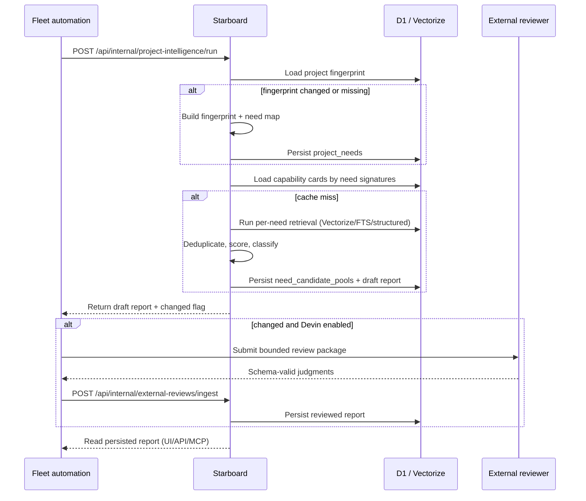

## Context

Starboard already connects public GitHub projects, retrieves hybrid candidates
from Vectorize + FTS + structured lanes, and reranks them deterministically with
visible evidence. The next step is to organize intelligence around project needs
rather than a single ranked list.

Issue #82 defines a full pipeline: precomputed repository capability cards,
project fingerprints, cached need maps, per-need catalog retrieval, draft
recommendation classification, optional Devin review, incremental reruns, and
reusable need-signature caches.

This change scopes the first shippable slice to Starboard's deterministic side:
- stable data model for capability cards, fingerprints, and needs
- per-need retrieval using existing search lanes
- candidate classification
- an offline script that emits the first Fleet project intelligence report
- a provider-neutral external-review contract so Fleet can later attach Devin
  reviews without coupling Starboard to Devin credentials

## Goals

- Need-driven reports: 5–10 evidence-backed needs per high-priority project,
  fewer when evidence is insufficient.
- Full-catalog per-need search without sending all 12k repository records to any
  agent.
- Reusable repository capability cards computed once per catalog fingerprint.
- Deterministic draft recommendations with evidence, classification, confidence,
  and provenance.
- Optional Devin review via a structured, provider-neutral ingestion contract.
- Incremental reruns that skip unchanged stages.
- Failure-safe report preservation: never overwrite a good report with a bad run.

## Non-Goals

- Shipping a Devin integration inside Starboard.
- Replacing the deterministic retrieval with an opaque agent-only flow.
- Automatically adopting dependencies or modifying projects.
- Private-repository scanning.
- A dedicated Fleet project-management surface in Starboard.

## Decisions

### 1. Data model lives in D1

Add tables for:
- `repo_capability_cards`: cached evidence-backed repo summary plus source
  fingerprint.
- `project_fingerprints`: stable input fingerprint for a connected project.
- `project_needs`: extracted needs, priority, constraints, evidence, normalized
  signature, and search intents.
- `need_candidate_pools`: reusable candidate list keyed by need signature +
  catalog generation + retrieval version.
- `project_draft_reports`: deterministic recommendation set grouped by need.
- `project_reviewed_reports`: final reviewed output with reviewer metadata.
- `external_review_requests`: idempotency key, status, request payload hash, and
  result schema.

Migrations are ordered SQL files; no ORM.

### 2. Capability cards are computed from catalog metadata + tool evidence

A card summarizes purpose, capabilities, language/tools, adoption type,
maintenance signals, embedding references, and provenance. Cards are refreshed
only when the source fingerprint (repo metadata, README hash, tool evidence,
AI metadata) changes.

### 3. Need extraction starts from project metadata and is validated by evidence

Needs are derived from the project's README, manifests, detected tools, public
roadmap signals, and owner priorities. Each need has a stable id, priority,
current state, desired outcome, constraints, evidence, and search intents.
The fingerprint hash gates recomputation.

### 4. Per-need retrieval reuses existing lanes

For each need, generate focused search intents, then run the existing
semantic/lexical/structured lanes against the full eligible catalog. Candidate
ids are deduplicated, scored, and hydrated. Diversity and evidence-strength
scoring happen per need.

### 5. Candidates are classified into five buckets

- `adopt_or_integrate`: suitable to use now.
- `reference_implementation`: study and borrow patterns.
- `architectural_pattern`: learn from design choices.
- `competing_product`: monitor, not adopt.
- `unsuitable_negative_example`: explicitly exclude with rationale.

### 6. External review contract is provider-neutral

Starboard exposes a small schema for review requests and results. Fleet (or any
orchestrator) owns Devin credentials, session creation, polling, spend limits,
and result submission. Starboard never stores Devin secrets and never requires
Devin to serve deterministic recommendations.

### 7. Offline script produces the first Fleet report

`scripts/fleet-project-intelligence.ts` reads the Fleet `projects.json`, resolves
catalog metadata, runs the deterministic pipeline for each P1/P2 maintained
project, and emits a Markdown report. It uses the same services the Worker
routes would use, but runs in Node with the D1 REST adapter or local bindings.

### 8. Incremental reruns use stored fingerprints and signatures

A run is skipped when the project fingerprint, need map, and catalog generation
are unchanged. New catalog additions are evaluated against persisted need
signatures and candidate thresholds before any external review is requested.

## Risks / Trade-offs

- **Need extraction quality** → Start with rule/heuristic extraction plus
  bounded LLM fallback; keep human review in the loop for the first reports.
- **Catalog growth** → Per-need lanes remain capped; candidate pools are cached.
- **Devin cost/availability** → Deterministic output is always available; Devin
  review is optional and bounded to one session per changed project.
- **Schema churn** → First migrations are additive; the existing project
  recommendation path keeps working.

## Migration Plan

1. Add D1 migrations for the new tables.
2. Implement capability-card generation and source-fingerprint invalidation.
3. Implement project fingerprinting and need extraction with caching.
4. Implement per-need retrieval, candidate classification, and draft report
   persistence.
5. Add the external-review request/result contract and ingestion endpoint.
6. Add the Fleet offline script and generate the first report.
7. Add tests for fingerprinting, caching, retrieval, classification, idempotency,
   and failure-safe report preservation.
8. Update product and architecture documentation.
9. Validate with lint, typecheck, tests, docs check, and Cloudflare build.

## Sequence

